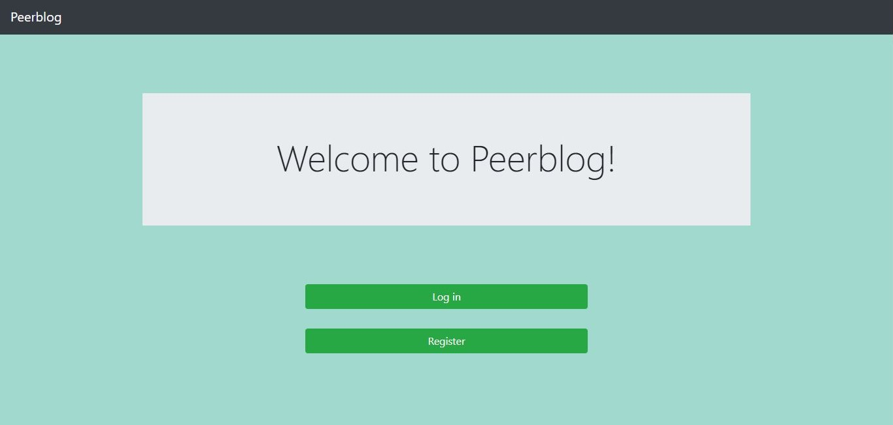

## Peer-blog

Peerblog is a very simple blog web application written in Flask and bootstrap.

Users can perform following actions in the app : 
- Create an account (using email and password) and then log in
- Create new blogs 
- Create new posts for each of the blogs
- Search for specific posts by author name
- View any other registered person's posts on home page


### Technologies used -

1.  Flask
2.  Pymongo
3.  Bootstrap
<hr>

### Basic setup

```
To setup and run the app locally, follow the below instructions -

1. Clone the repo locally.
2. cd into the home directory, where 'requirements.txt' file resides.
3. open cmd and issue command pip install -r requirements.txt (if on linux, run pip3 install -r requirements.txt)
4. cd into 'src' folder and issue command 'python app.py' to run the app
```

<hr>

### Home page :)


<hr>
